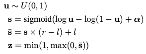
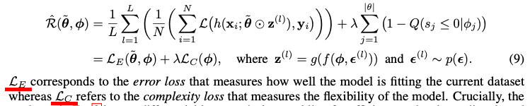
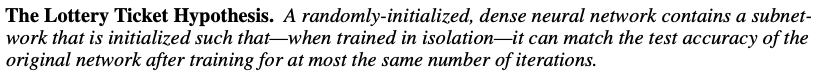
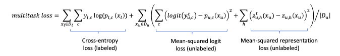

# Что было показано в статьях?

## Extreme Language Model Compression With Optimal Subwords and Shared Projections

https://arxiv.org/pdf/1909.11687.pdf

Необычный способ KD: авторы предлагают одновременно обучать учителя и студента, необычный лосс, который позволяет(?) учить парамеры между слоями учителя и студента, у учителя и студента свои embeddings, но учитель принимает оба варианта при обучении. Главный результат: снижения размера модели в 60 раз, до 7 mb.
Лосс тоже обучается, что странно.

## TINYBERT: DISTILLING BERT FOR NATURAL LANGUAGE UNDERSTANDING

https://arxiv.org/pdf/1909.10351.pdf

Один из первых методов дистиляции трансформеров. Есть лосс на слои (используется специальная функция отображения) и на механизм внимания, эмбеддинги, предсказания для файн тюнинга. Для предикшина используется обычный для дистиляции метод передачи знаний. В отличии от экстрима, не учит учителя, а использует уже обученную модель. Небольшой выйгрыш в уменьшении модели.

## ALBERT: A LITE BERT FOR SELF-SUPERVISED LEARNING OF LANGUAGE REPRESENTATIONS

https://arxiv.org/pdf/1909.11942.pdf

CROSS-LAYER PARAMETER SHARING

## Patient Knowledge Distillation for BERT Model Compression

https://arxiv.org/pdf/1908.09355.pdf

Расшариваются не все статьи при обучении, либо k последних, либо каждый k слой. Нормализация скрытого состояния в лоссе.

## Q-BERT: Hessian Based Ultra Low Precision Quantization of BERT

https://arxiv.org/pdf/1909.05840.pdf

Квантивизация весов для работы в устройствах с меньшим объемом памяти. Используется матрица вторых производных для оптимизации.

## L-0 оптимизации:
### Structured Pruning of Large Language Models

https://arxiv.org/pdf/1910.04732.pdf

- Обучение обратной функции распределения
  
  z - маска на веса
- Для маски применалось два метода: Без разложения на две матрицы и с ним.

### LEARNING SPARSE NEURAL NETWORKS THROUGH L0 REGULARIZATION

https://arxiv.org/abs/1712.01312

Добавление внутри лосса сложность модели

Вывод по L_0 оптимизации: позволяет оценить сложность(структурность?) модели.

## THE LOTTERY TICKET HYPOTHESIS: FINDING SPARSE, TRAINABLE NEURAL NETWORKS

https://arxiv.org/pdf/1803.03635.pdf

Гипотеза: заморозить некоторые веса во время обучения, смотреть что дальше будет.

Чтобы найти этот выйгышный билет, обучать сеть, заморозим  \begin{equation}  p\%  \end{equation}  весов с найменьшими весами, реинициализируем остальные. Итерируем эту операцию (\begin{equation} p^{\frac{1}{n}} \end{equation}), получаем наименьшую по размеру выигрышный билет.
Результат: можно уменьшать модель до 20% без уменьшения качества.

##  DISTILLING TRANSFORMERS INTO SIMPLE NEURAL NETWORKS WITH UNLABELED TRANSFER DATA

https://arxiv.org/pdf/1910.01769.pdf

Дистиляция данных под специфическую задачу. Используя BERT_large как учителя, учится LSTM модель под нужную задачу. Рассматривали задачу классификации текстов. Также использовали датасеты с неотмеченными данными, используя учителя для неявной разметки.

Можно оценивать каждый лосс по разному, добавляя веса к каждому из них.
