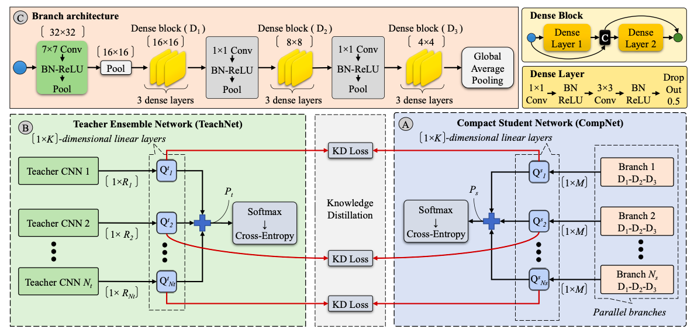

# Article Essence 02 – Teacher Assistant Learning и Neural Architecture Search

В основном эти темы рассматривались в тематике CV задач(некоторые статьи опубликованны в 2019 году), и мало что было примененно для дистиляции bert или выбора нужных архитектур(но начинают появлятся). Что есть в этих статьях и чего нет?

## Teacher assistant learning

Главная идея TAL – вместо использования большой модели учителя и маленького студента делать несколько студентов, которые последовательно обучают друг друга.

### Deep Mutual Learning

https://arxiv.org/pdf/1706.00384.pdf

Несколько моделей-студентов, обучают друг друга. Для дистилляции используется KL-дивергенция на софтмаксе вывода. Во время backpropa не обучается модель, выводы которой используются для обучения. Эксперименты были сделаны на CIFAR-100 и Market-1501. Результаты: 2%.

### Preparing Lessons: Improve Knowledge Distillation with Better Supervision

https://arxiv.org/pdf/1911.07471.pdf

Добавляются два приближения к KD: Knowledge Adjustment and Dynamic Temperature Distillation. В первом сглаживаются вероятности от учителя с помощью шума и  меняются истинные значения на предсказания учителя("Не правильно определенные классы могут содержать похожи признаки, что может содержать больше информации"). Во втором вместо фиксированной температуры используется вычисляемая через веса. Эти решения добавляют 2% в точности.

### Ensemble Knowledge Distillation for Learning Improved and Efficient Networks

https://arxiv.org/pdf/1909.08097.pdf

Создает мета сеть из учителей и студентов, с помощью которой последние учатся. Смотреть на картинку. 

Из-за такой архитектуры можно обучать несколько моделей-студентов и получить наиболее эффективную модель.
Результат: 2% на CIFAR-10 и 4% на CIFAR-100.

### Knowledge Transfer Graph for Deep Collaborative Learning

https://arxiv.org/pdf/1909.04286.pdf

Объединение метода KD и DML. Из студентов и учителей создается сеть обучения(передачи знаний). Применяются гейты для прохождения между моделями. Происходит оптимизация не только моделей, но и архитектуры графа. Этот метод дает всё те же 2%.

### Improve Knowledge Distillation via Teacher Assitant: Brdiging the Gap Between Student and Teacher

https://arxiv.org/pdf/1902.03393.pdf

Есть гипотеза, что похожие модели будут лучше передавать знания, чем разные. Авторы этой статьи решили использовать размер как метрику похожести, и продемонстрировали это в экспериментах. Для обучения маленьких моделей они предложили обучать среднюю модель, затем с помощью неё обучать маленькую. Результат: 2%.